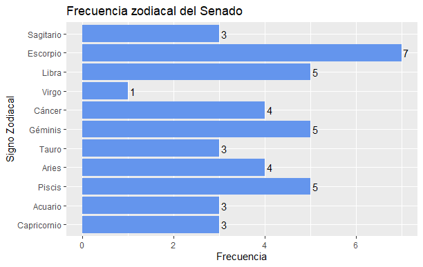

Distribución zodiacal del congreso
================
Agustín Gutiérrez
01-12-2020

# Resumen

Quería poner en práctica conocimientos que había adquirido, además de
aprender a hacer scraping en R. Se me ocurrió ver la distribución
zodiacal del congreso a partir de la página de la [biblioteca del
congreso nacional](https://www.bcn.cl/index_html). Este repositorio
comparte el código y los resultados, que se pueden ver en los gráficos
abajo. Inicialmente esto iría acompañado de la documentación apropiada y
un tutorial, pero cometí el error de comenzar ambas cosas una vez tuve
el código listo, lo cual lo vuelve una tarea desmotivante en este
momento. Pero aprendí la lección y haré la documentación a medida que
escriba el código en el futuro.

Es posible que en el futuro arregle el código para volverlo más bonito y
eficiente, a la vez que añada el tutorial/documentación. Pero no son
prioridad por ahora.

P.S.: Este es mi primer repo en Git c: