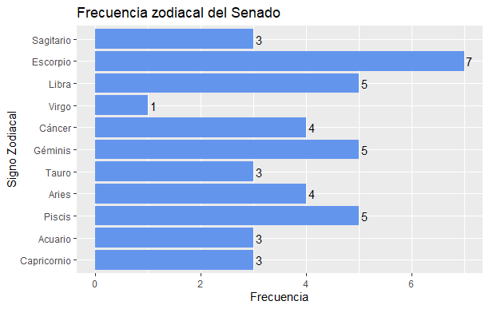

Distribución zodiacal del congreso
================
Agustín Gutiérrez
22-11-2020

# Resumen

Quería poner en práctica conocimientos que había adquirido, además de
aprender a hacer scraping en R. Se me ocurrió ver la distribución
zodiacal del congreso a partir de la página de la [biblioteca del
congreso nacional](https://www.bcn.cl/index_html). Este repositorio
comparte el código y documentación de los resultados, que se pueden ver
en los siguientes gráficos:  

